# 🏗️ System Architecture Documentation

## Overview

The Islamic Characters platform follows a microservices architecture with clear separation of concerns, designed for scalability, maintainability, and performance.

## High-Level Architecture

```
┌─────────────────┐    ┌─────────────────┐    ┌─────────────────┐
│   Frontend      │    │   Backend API   │    │   Database      │
│   (React SPA)   │◄──►│   (FastAPI)     │◄──►│  (PostgreSQL)   │
└─────────────────┘    └─────────────────┘    └─────────────────┘
                                │
                                ▼
                       ┌─────────────────┐
                       │   Redis Cache   │
                       │   (Optional)    │
                       └─────────────────┘
                                │
                                ▼
                       ┌─────────────────┐
                       │   File Storage  │
                       │   (Local/S3)    │
                       └─────────────────┘
```

## Component Architecture

### 1. Frontend Layer

**Technology Stack:**
- React 18+ with TypeScript
- Vite for build tooling
- TailwindCSS for styling
- React Router for navigation
- Axios for API communication

**Key Components:**
- **Pages**: Route-level components (CharacterDetail, Timeline, etc.)
- **Components**: Reusable UI components (CharacterHero, TimelineView, etc.)
- **Services**: API client and state management
- **Utils**: Helper functions and utilities

**Data Flow:**
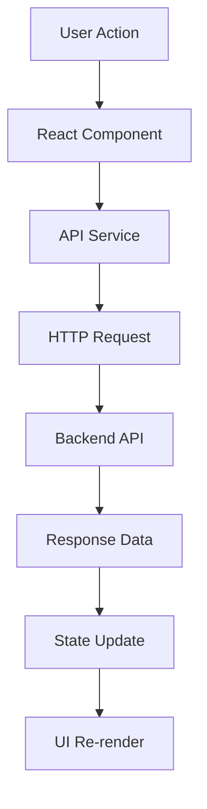

### 2. Backend API Layer

**Technology Stack:**
- FastAPI for REST API framework
- SQLAlchemy ORM for database operations
- Pydantic for data validation
- Redis for caching (optional)
- JWT for authentication

**Core Modules:**

#### API Routes (`app/api/`)
```
/api/
├── characters.py      # Character CRUD operations
├── auth.py           # Authentication endpoints
├── content.py        # Content management
├── progress.py       # User progress tracking
├── users.py          # User management
├── media.py          # File upload/management
├── analytics.py      # Usage analytics
├── stats.py          # Statistics
└── recommendations.py # Content recommendations
```

#### Business Logic (`app/`)
```
app/
├── models.py         # SQLAlchemy ORM models
├── schemas.py        # Pydantic data schemas
├── database.py       # Database configuration
├── cache.py          # Redis caching layer
├── security.py       # Authentication/authorization
├── config.py         # Application settings
├── logging_config.py # Logging configuration
└── utils/            # Helper utilities
```

### 3. Data Layer

#### Database Schema

```mermaid
erDiagram
    User ||--o{ UserProgress : tracks
    UserProgress }o--|| IslamicCharacter : tracked
    
    User {
        int id PK
        string username UK
        string email UK
        string full_name
        string hashed_password
        boolean is_active
        string language
        string theme
        datetime created_at
        datetime updated_at
    }
    
    IslamicCharacter {
        int id PK
        string name
        string arabic_name
        string english_name
        string title
        text description
        int birth_year
        int death_year
        string era
        string category
        string sub_category
        string slug UK
        text full_story
        json key_achievements
        json lessons
        json quotes
        json timeline_events
        string profile_image
        json gallery
        json audio_stories
        json animations
        string birth_place
        string death_place
        json locations
        json related_characters
        int views_count
        int likes_count
        int shares_count
        boolean is_featured
        boolean is_verified
        string verification_source
        text verification_notes
        datetime created_at
        datetime updated_at
    }
    
    UserProgress {
        int id PK
        int user_id FK
        int character_id FK
        float completion_percentage
        json viewed_content
        json bookmarks
        json notes
        datetime last_accessed
        datetime created_at
        datetime updated_at
    }
```

## Data Flow Architecture

### 1. Character Data Flow

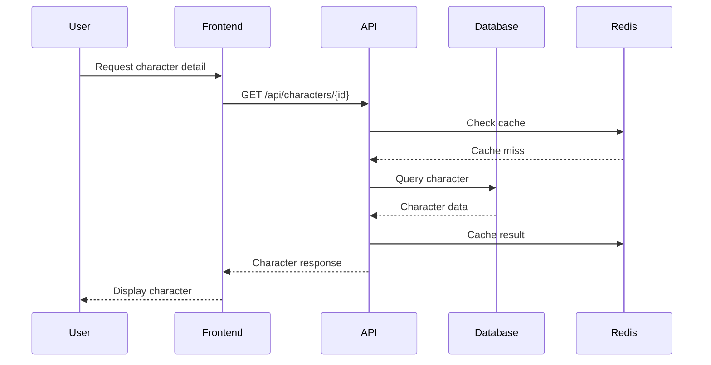

### 2. User Progress Flow

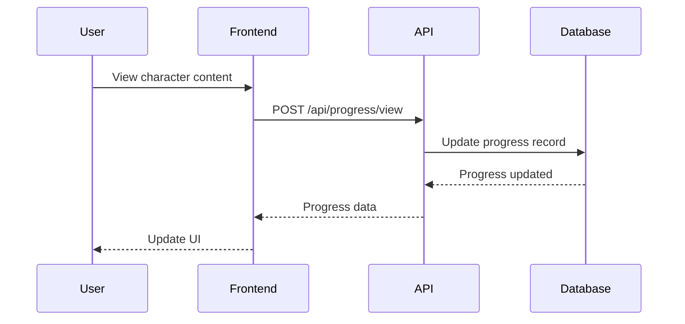

### 3. Search Flow

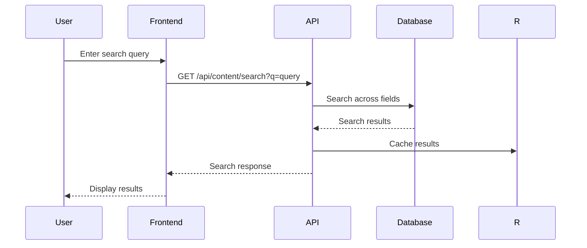

## Security Architecture

### Authentication Flow

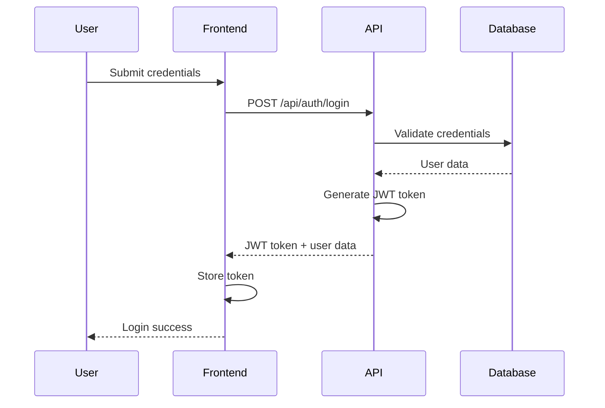

### Authorization Model

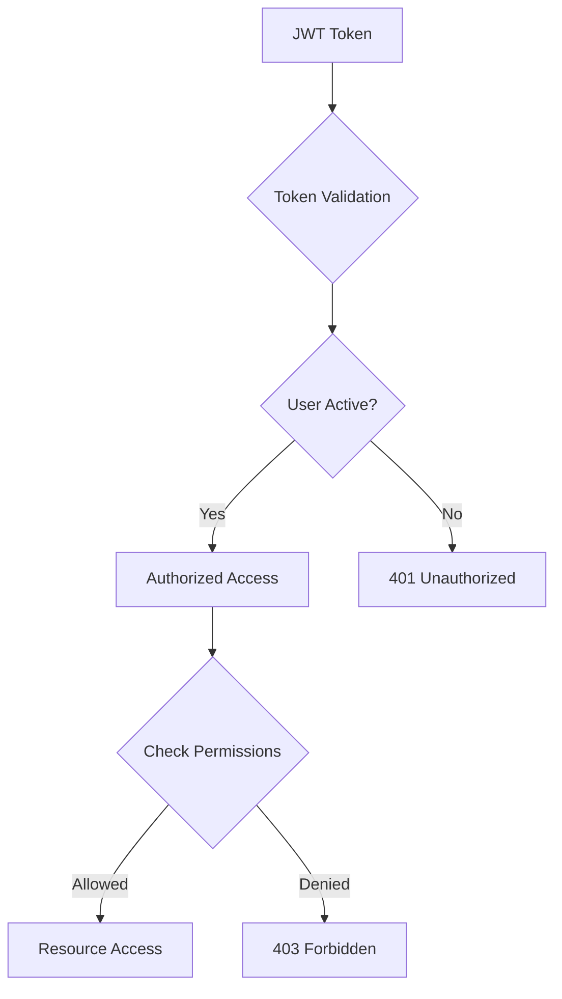

## Caching Strategy

### Cache Hierarchy

1. **Application Cache** (Memory)
   - User sessions
   - Configuration data
   - Temporary computations

2. **Redis Cache** (Distributed)
   - Character details (10 min)
   - Featured content (5 min)
   - Search results (2 min)
   - Categories/Eras (1 hour)

3. **Database Cache** (PostgreSQL)
   - Query result caching
   - Connection pooling
   - Index caching

### Cache Invalidation

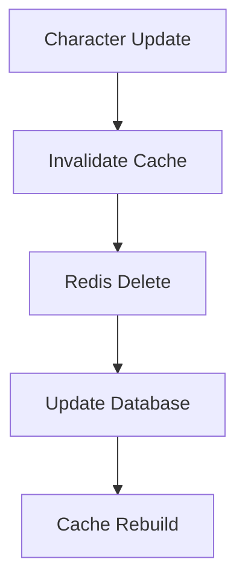

## Performance Architecture

### Database Optimization

**Indexing Strategy:**
```sql
-- Primary indexes
CREATE INDEX idx_characters_id ON islamic_characters(id);
CREATE INDEX idx_characters_slug ON islamic_characters(slug);

-- Search indexes
CREATE INDEX idx_characters_name ON islamic_characters(name);
CREATE INDEX idx_characters_arabic_name ON islamic_characters(arabic_name);
CREATE INDEX idx_characters_search ON islamic_characters USING gin(to_tsvector('arabic', name || ' ' || arabic_name || ' ' || description));

-- Filter indexes
CREATE INDEX idx_characters_category ON islamic_characters(category);
CREATE INDEX idx_characters_era ON islamic_characters(era);
CREATE INDEX idx_characters_featured ON islamic_characters(is_featured);

-- Performance indexes
CREATE INDEX idx_characters_views ON islamic_characters(views_count DESC);
CREATE INDEX idx_characters_likes ON islamic_characters(likes_count DESC);
CREATE INDEX idx_characters_created ON islamic_characters(created_at DESC);
```

### Query Optimization

**Connection Pooling:**
```python
# Database configuration
DATABASE_POOL_SIZE = 20
DATABASE_MAX_OVERFLOW = 30
DATABASE_POOL_TIMEOUT = 30
DATABASE_POOL_RECYCLE = 3600
```

**Query Optimization:**
- Use `select_related` for eager loading
- Implement pagination for large datasets
- Use database functions for aggregations
- Optimize N+1 queries with joins

## Monitoring Architecture

### Logging Structure

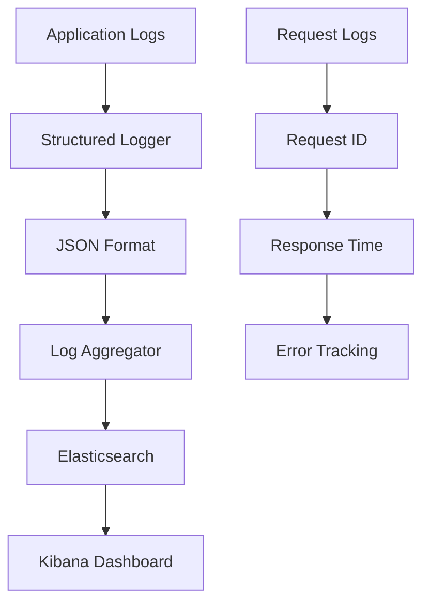

### Metrics Collection

**Application Metrics:**
- Request count and response times
- Database query performance
- Cache hit rates
- Error rates by endpoint
- User activity statistics

**System Metrics:**
- CPU and memory usage
- Database connections
- Redis performance
- File system usage

## Deployment Architecture

### Development Environment

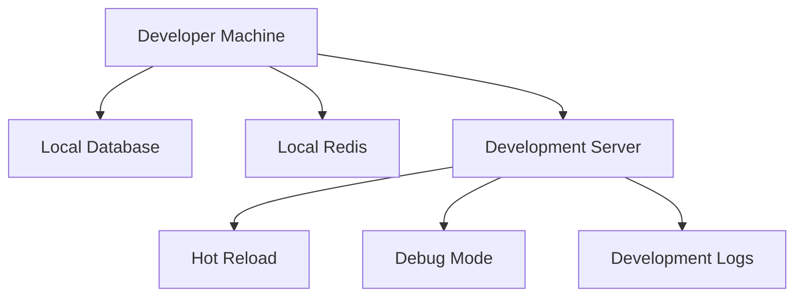

### Production Environment

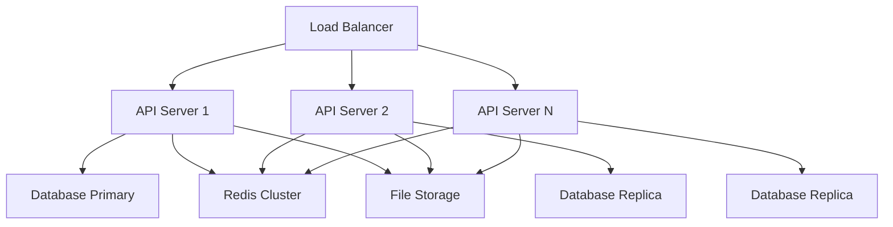

### Container Architecture

```dockerfile
# Dockerfile
FROM python:3.10-slim

WORKDIR /app
COPY requirements.txt .
RUN pip install -r requirements.txt

COPY . .
EXPOSE 8000

CMD ["uvicorn", "app.main:app", "--host", "0.0.0.0", "--port", "8000"]
```

```yaml
# docker-compose.yml
version: '3.8'
services:
  api:
    build: .
    ports:
      - "8000:8000"
    environment:
      - DATABASE_URL=postgresql://user:pass@db:5432/app
      - REDIS_URL=redis://redis:6379
    depends_on:
      - db
      - redis
  
  db:
    image: postgres:15
    environment:
      - POSTGRES_DB=on_their_footsteps
      - POSTGRES_USER=user
      - POSTGRES_PASSWORD=pass
    volumes:
      - postgres_data:/var/lib/postgresql/data
  
  redis:
    image: redis:7-alpine
    ports:
      - "6379:6379"
    volumes:
      - redis_data:/data
```

## Scalability Architecture

### Horizontal Scaling

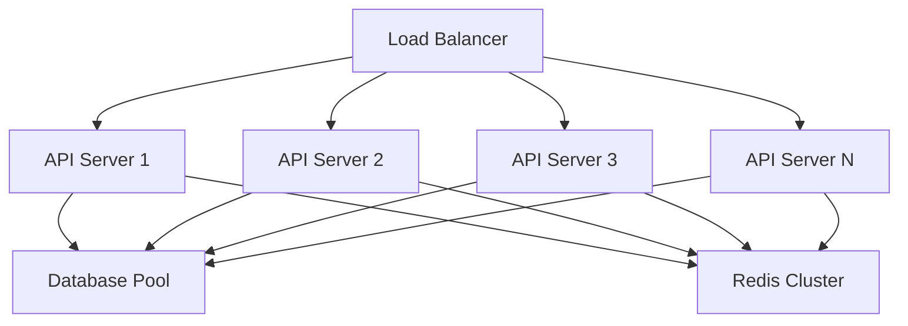

### Database Scaling

**Read Replicas:**
- Primary database for writes
- Multiple read replicas for queries
- Connection routing based on operation type

**Sharding Strategy:**
- Horizontal partitioning by category
- Consistent hashing for distribution
- Cross-shard query support

## Integration Architecture

### External Services

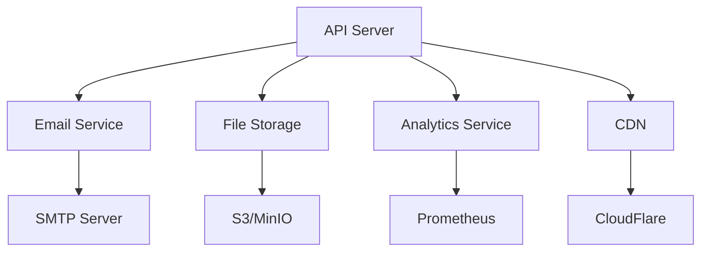

### Third-Party Integrations

**Authentication Providers:**
- OAuth 2.0 (Google, Facebook)
- SAML 2.0 (Enterprise SSO)
- LDAP/Active Directory

**Payment Processing:**
- Stripe (Credit Cards)
- PayPal (Digital Wallets)
- Local Payment Methods

**Communication:**
- Email (SendGrid, SES)
- SMS (Twilio)
- Push Notifications (Firebase)

## Development Workflow

### Code Organization

```
backend/
├── app/                    # Application code
│   ├── api/               # API routes
│   ├── models/            # Database models
│   ├── schemas/           # Data schemas
│   ├── services/           # Business logic
│   ├── utils/              # Utilities
│   └── config/            # Configuration
├── tests/                  # Test suite
├── migrations/             # Database migrations
├── docs/                   # Documentation
├── scripts/                # Utility scripts
└── requirements.txt         # Dependencies
```

### Development Process

1. **Feature Development**
   - Create feature branch
   - Implement code changes
   - Write tests
   - Update documentation

2. **Code Review**
   - Peer review process
   - Automated checks
   - Security review
   - Performance review

3. **Testing**
   - Unit tests
   - Integration tests
   - API tests
   - Performance tests

4. **Deployment**
   - Staging deployment
   - Integration testing
   - Production deployment
   - Monitoring setup

## Technology Decisions

### Framework Choices

**FastAPI:**
- High performance with async support
- Automatic OpenAPI documentation
- Type hints and validation
- Modern Python features

**SQLAlchemy:**
- Powerful ORM with relationship support
- Database agnostic design
- Migration support
- Performance optimization

**Redis:**
- In-memory caching for performance
- Session storage
- Rate limiting
- Pub/Sub messaging

### Database Design

**PostgreSQL:**
- Advanced JSON support
- Full-text search
- Window functions
- ACID compliance
- Extensible with extensions

## Future Architecture Plans

### Microservices Migration

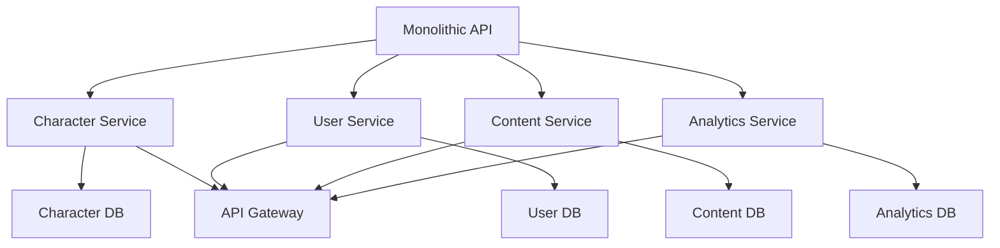

### Event-Driven Architecture

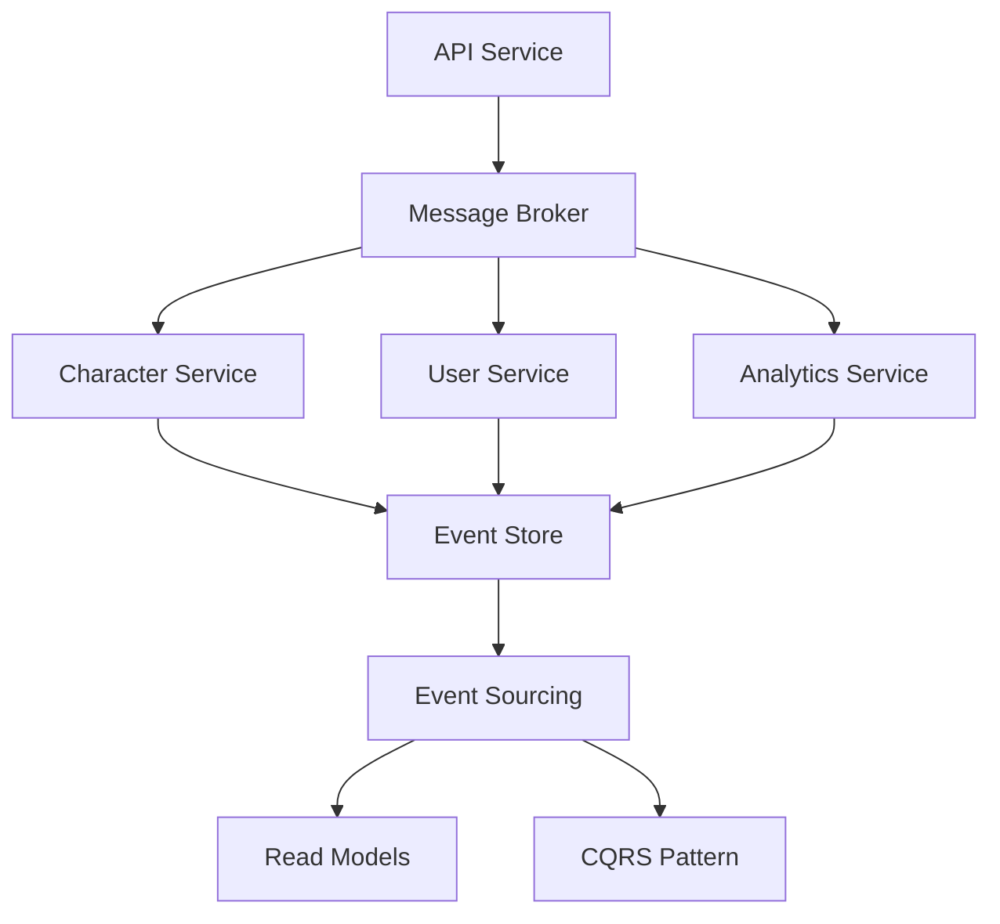

## Security Considerations

### Data Protection

- **Encryption at Rest**: Database encryption
- **Encryption in Transit**: HTTPS/TLS
- **Data Anonymization**: PII protection
- **Access Control**: Role-based permissions

### Threat Mitigation

- **Injection Prevention**: Parameterized queries
- **Authentication**: JWT with refresh tokens
- **Rate Limiting**: Request throttling
- **Input Validation**: Comprehensive validation
- **CORS Configuration**: Proper origin handling

### Compliance

- **GDPR**: Data protection regulations
- **Privacy Policy**: User data handling
- **Audit Logging**: Comprehensive audit trail
- **Data Retention**: Policy-based retention

This architecture provides a solid foundation for the Islamic Characters platform with room for growth and evolution as requirements change.
